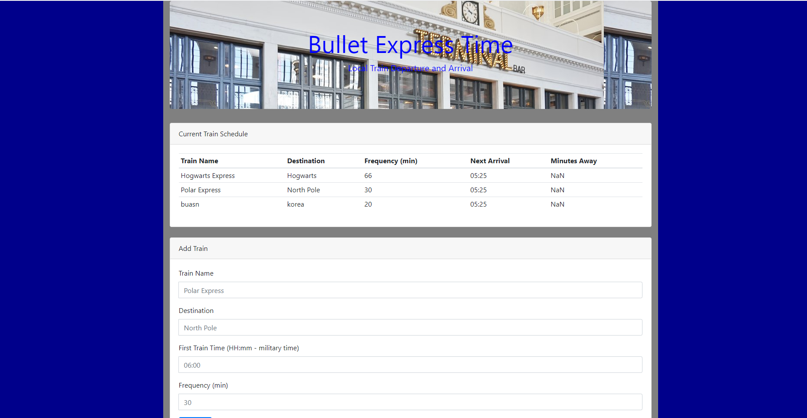

# FireTrain

## The link to play with this app: "https://skip1113.github.io/FireTrain/index.html"

## Overview
This is a Train Schedule Application that will calculate and update a train, destination, train frequency, the next Arrival, and the minutes away the train is.

Add a train name, Destination, the first train time and the Frequency of the train. Be creative, and watch as the application calulates the time of your next arrival and how long your next train will be.

This Application has storage stored in fire base. Using JavaScript, HTML, FireBase key, moment.js, and Data Persisting to keep the data when closed or refreshed.

Some functions of this Application is Real time update, change, and time calculations. FireBase API Key, database refs and values to store the inputs to fire base. Child Appending, and Updating HTML.

## Organization
* Test and connected to Firebase
* Test Moment for current time
* Created form for user input
* Tested onClick functions
* Took form values and pushed them to the database
* Created functions to calulate arrivals, departure, and frequency times

## Technology used:
* Javascript
* jQuery
* Firebase
* Moment.js